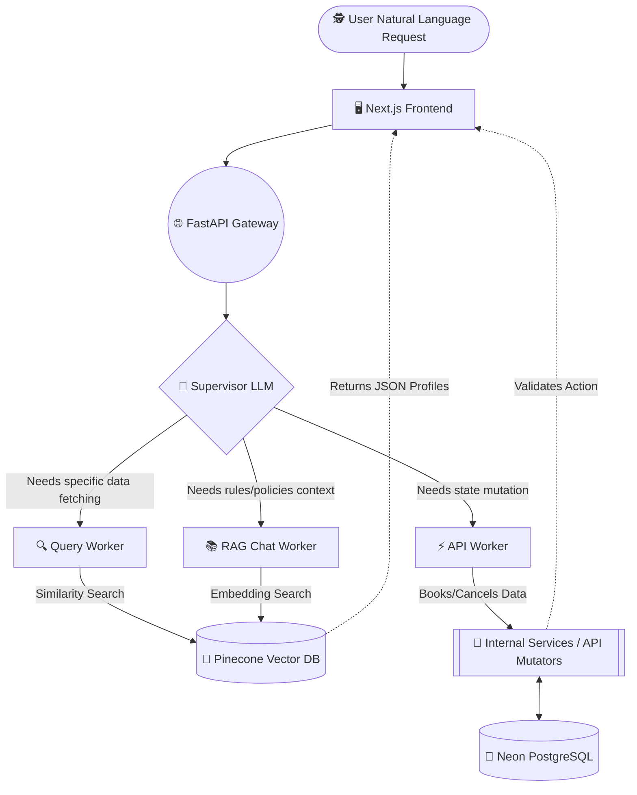
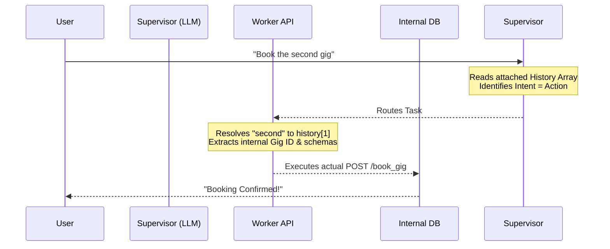

<div align="center">
  <h1>🚀 SkillAmigo</h1>
  <p><strong>The Next-Generation Agentic Service Exchange Platform</strong></p>
  
  [](https://fastapi.tiangolo.com/)
  [](https://nextjs.org/)
  [](https://langchain.com/)
  [](https://pinecone.io/)
</div>

<br/>

**SkillAmigo** is a hybrid AI-powered platform for exchanging services (gigs). It serves as an intelligent matchmaking tool between users and service providers. What differentiates it from standard marketplaces is its **Agentic Backend Architecture**. Users can write natural language queries (e.g., *"Find React developers in Bangalore under ₹2000"* or *"Book the first one from my last search"*), which are dynamically translated into SQL, vector search matching, or actionable API calls.

---

## 🏗️ System Architecture

SkillAmigo operates on a decoupled architecture where the backend functions as an orchestrating brain handling intent extraction, database retrieval, and state mutation.



---

## 🐍 Backend Breakdown (`AI-backend`)

The backend is built using **Python / FastAPI** and heavily relies on **LangChain** and **Gemini 2.5 Flash** to evaluate user prompts and route them effectively.

### Core Architecture Files:
- **`main.py`**: The API gateway. It exposes endpoints like `/process`, `/search_worker`, `/book_worker`, `/supervisor`, and handling CORS for the Next.js frontend.
- **`supervisor.py`**: The top-level intent router. Using an LLM Chain, it evaluates whether the request is a **Query** (searching/listing gigs or users) or an **API action** (booking, canceling).
- **`agent.py`**: Handles intent extraction and search logic. It interacts directly with `Pinecone` to perform cosine similarity searches on `users_index` and gig `index`.
- **`worker.py`**: Works as a dynamic gateway proxy. Given conversational `history` containing lists of previously viewed gigs, it constructs an exact JSON payload (e.g., extracting the UUID when a user says *"book that second one"*).
- **`chat_worker.py`**: The conversational AI interface. This bot implements an extensive **RAG Pipeline** for answering user questions intelligently based solely on platform policy context, avoiding hallucinations.
- **`upload.py` & `rag_upload.py`**: Tooling scripts used to batch-chunk and upload gig items, user data, and system policy manuals directly to the Pinecone Vector Indices.

---

## 🧠 Dynamic Agent Workflows

### Context-Aware Intent Routing
The system manages a continuous state, maintaining an array known as `history` containing previously retrieved gigs.



### Deep RAG (Retrieval-Augmented Generation) Pipeline
Using `chat_worker.py`, SkillAmigo supplies the LLM with definitive platform rules (Refund Policies, Anti-Fraud Systems, Pricing, etc.).

1. **Chunking & Storage**: Text documents defining rules are chunked using `rag_upload.py` and uploaded into `retreval-index` via `llama-text-embed-v2`.
2. **Context Injection**: When a user asks about refunds, the system executes a Pinecone similarity search.
3. **Augmented Prompt**: The Top 3 closest vector chunks are pulled and injected into the Gemini Multi-Shot prompt.
4. **Source-Backed Responses**: The assistant responds accurately and provides the `policy_seen` metadata array as citations.

---

## 🛠️ Tech Stack 

**Frontend (`NextApp`):**
- **Framework**: React 19 + Next.js 15.4 (App Router, Turbopack)
- **Styling**: Tailwind CSS v4, Lucide React (icons), Radix UI components
- **Animations**: native integration of Framer Motion (`motion`) and GSAP (`gsap`)
- **Database & Auth**: `@neondatabase/serverless` connected with `node-pg-migrate`, using `next-auth` (v4) for sessions.

**Backend (`AI-Backend`):**
- **API Framework**: Python 3 / FastAPI
- **LLM Orchestration**: LangChain + `langchain_google_genai` (Gemini-2.5-flash)
- **Vector Database**: Pinecone (supporting hybrid relational & dense vectors)

---

## 🚀 Installation & Running Locally

### 1. Clone the Repository
```bash
git clone https://github.com/sachingiri01/SkillAmigo.git
cd SkillAmigo
```

### 2. Backend Setup
```bash
cd AI-backend

# Initialize Virtual Environment
python -m venv venv
source venv/bin/activate  # Or `venv\Scripts\activate` on Windows

# Install Dependencies
pip install -r requirements.txt

# Create .env file for environment variables
# You MUST provide keys for Pinecone, Google Gemini, etc.
# Example `.env` file implementation:
# GOOGLE_API_KEY=your_gemini_key
# PINECONE_API_KEY=your_pinecone_key
# INDEX_NAME=skillamigo-index
# USER_INDEX=USER_INDEX
# RETREVAL_NAME=retreval-index

# Start the Backend Server
uvicorn main:app --reload --port 8000
```

### 3. Frontend Setup
Open a new terminal window:
```bash
cd NextApp

# Install packages
npm install

# Setup environment variables
cp .env.local.example .env.local

# Optional Database Migrations
npm run migrate:up

# Start Development Server
npm run dev
```
Navigate to `http://localhost:3000` to interact with the Next.js platform interfacing with your agentic backend!

<br/>

## ⭐ If you love this project, consider giving it a star!
